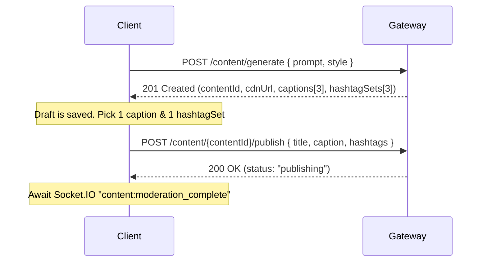
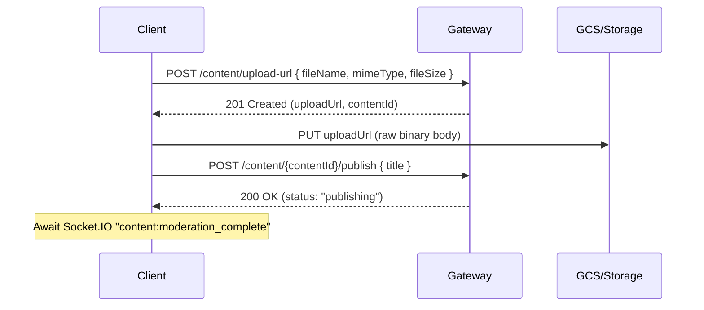

# nxClip Frontend Integration Guide

> **Audience:** Web and mobile client developers integrating with nxClip.  
> **Gateway base URL (Production):** `https://api-gateway-216098834386.us-central1.run.app`  
> **Gateway base URL (Local development):** `http://localhost:5000`  
> **Generated from implemented backend.** See also [api-reference.md](./api-reference.md) for exhaustive endpoint detail.

---

## Quick setup

```typescript
const API_BASE = import.meta.env.VITE_API_URL ?? 'http://localhost:5000';

const api = async (path: string, init: RequestInit = {}) => {
  const correlationId = crypto.randomUUID();
  const res = await fetch(`${API_BASE}${path}`, {
    ...init,
    credentials: 'include', // sends nx_access_token / nx_refresh_token cookies
    headers: {
      'Content-Type': 'application/json',
      'X-Correlation-Id': correlationId,
      ...init.headers,
    },
  });
  if (!res.ok) throw await res.json().catch(() => ({ statusCode: res.status }));
  return res.status === 204 ? null : res.json();
};
```

For Bearer-token clients (mobile, SSR without cookies), set `Authorization: Bearer <accessToken>` and manage refresh manually.

---

## 1. Authentication & Onboarding Flow

### Overview

nxClip uses **JWT access tokens** (1 hour) and **refresh tokens** (30 days). Identity-service issues both on register/login and can store them in **HTTP-only cookies**:

| Cookie | Purpose | Max-Age |
|--------|---------|---------|
| `nx_access_token` | Short-lived JWT | 1 hour |
| `nx_refresh_token` | Rotation refresh token | 30 days |

Cookie flags: `HttpOnly`, `SameSite=Lax`, `Secure` in production, `Path=/`.

The API gateway validates JWT on all routes except an explicit public allowlist. Valid requests are proxied upstream with `X-User-Id` set from the token `sub` claim.

### Registration & Verification

```
POST /auth/register
```

1. Client sends `RegisterRequest` (see Request DTOs).
2. Server responds `201` with `AuthResponse` (user + tokens).
3. Cookies are set automatically when using `credentials: 'include'`.
4. Store `user.id` in client state; tokens are in cookies or response body.
5. In development, if SMTP is disabled, the verification token can be fetched using `GET /auth/dev/verification-token?email=...` and submitted to `POST /auth/verify-email` to set `emailVerified: true`.

**Availability checks (optional UX):**

- `GET /auth/check-email?email=...` → `{ available: boolean }`
- `GET /auth/check-username?username=...` → `{ available: boolean }`

### Onboarding State

After authentication, the profile (`GET /auth/me` or `GET /users/me`) returns user details including:
- `onboardingCompleted`: `boolean` (false until Creator Coach onboarding is finished).
- `onboardingPlan`: `OnboardingPlan | null` (stores the 7-day recommended creation schedule once generated).

Gate the client dashboard or onboarding wizard based on `onboardingCompleted`.

---

## 2. API Endpoints

All paths below are relative to the **gateway** (`http://localhost:5000` locally, or `https://api-gateway-216098834386.us-central1.run.app` in production).

### Gateway Path Splitting (Activated)

The API Gateway proxy dynamically parses subpaths to map engagement and follow endpoints to the correct services. **Direct microservice port calls (5003, etc.) are obsolete!**

### Identity & Profiles (`/auth`, `/users`)

| Method | Path | Auth | Description |
|--------|------|------|-------------|
| POST | `/auth/register` | Public | Create account |
| POST | `/auth/login` | Public | Sign in |
| POST | `/auth/refresh` | Public | Rotate tokens |
| POST | `/auth/logout` | JWT | Sign out |
| GET | `/auth/me` | JWT | Current user profile |
| GET | `/auth/check-email` | Public | Email availability |
| GET | `/auth/check-username` | Public | Username availability |
| POST | `/auth/verify-email` | Public | Confirm email |
| GET | `/auth/dev/verification-token` | Public | Development verification token lookup (Dev only) |
| GET | `/users/me` | JWT | Profile (same as `/auth/me`) |
| PATCH | `/users/me` | JWT | Update profile bio/avatar |
| GET | `/users/{id}` | Public | Public profile by ID |
| POST | `/users/{id}/follow` | JWT | Follow user (routed to feed-service) |
| GET | `/users/{id}/profile` | Public* | Follower counts (routed to feed-service) |

### Creator Coach Onboarding (`/coach/onboarding`)

Interactive onboarding powered by the AI Service.

| Method | Path | Auth | Description |
|--------|------|------|-------------|
| POST | `/coach/onboarding/start` | JWT | Start or resume onboarding session |
| GET | `/coach/onboarding/status` | JWT | Get current onboarding state/progress |
| POST | `/coach/onboarding/answer` | JWT | Submit answer to current question |
| POST | `/coach/onboarding/generate-plan` | JWT | Generate AI 7-day plan & finalize |

### Content & Studio (`/content`)

| Method | Path | Auth | Description |
|--------|------|------|-------------|
| POST | `/content/upload-url` | JWT | Presigned upload URL (Journey B) |
| POST | `/content/generate` | JWT | Inline AI image/meme generation (Journey A) |
| GET | `/content` | Public | List published content catalog |
| GET | `/content/mine` | JWT | List own content (all statuses) |
| GET | `/content/mine/{id}`| JWT | Detail of owned draft/processing item |
| GET | `/content/{id}` | Public | Get published catalog item |
| GET | `/content/{id}/media` | JWT | Streamed / redirect authenticated media file |
| PATCH | `/content/{id}` | JWT | Edit title/description (if rejected) |
| POST | `/content/{id}/retry-generation` | JWT | Retry failed generation |
| POST | `/content/{id}/publish` | JWT | Submit for moderation |
| DELETE | `/content/{id}` | JWT | Soft delete item |
| POST | `/content/{id}/like` | JWT | Like content (routed to feed-service) |
| POST | `/content/{id}/comment` | JWT | Add comment (routed to feed-service) |
| GET | `/content/{id}/comments` | Public | List comments (routed to feed-service) |

### Feed (`/feed`)

| Method | Path | Auth | Description |
|--------|------|------|-------------|
| GET | `/feed` | JWT | Personalized following feed |
| GET | `/feed/trending` | Public* | Discovery feed |
| GET | `/feed/{id}` | Public* | Single feed projection |

### Analytics (`/analytics`)

| Method | Path | Auth | Description |
|--------|------|------|-------------|
| POST | `/analytics/events` | JWT | Ingest client interaction event |
| GET | `/analytics/metrics` | JWT | Dashboard metrics counts |
| GET | `/analytics/report/latest` | JWT | Latest weekly PDF report |

---

## 3. Request DTOs

### Creator Coach Onboarding

**`OnboardingStartRequest`**
```typescript
interface OnboardingStartRequest {
  category?: string; // Optional: "Gaming" | "General" | "Travel" | "Food" | "Cooking"
  reset?: boolean;   // Optional: true to clear saved progress
}
```

**`OnboardingAnswerRequest`**
```typescript
interface OnboardingAnswerRequest {
  question: number;         // 0 (category choice) to 5
  answer: string | string[]; // string (Q2-Q5 or Q0) or string[] (multi-select Q1 niches)
}
```

### Content Generation & Uploads

**`GenerateImageRequest`**
```typescript
interface GenerateImageRequest {
  prompt: string;
  style?: 'cinematic' | 'meme' | 'pixel_art' | 'cartoon' | 'realistic';
  aspectRatio?: '1:1' | '16:9' | '9:16';
  model?: string;
}
```

**`UploadUrlRequest`**
```typescript
interface UploadUrlRequest {
  fileName: string;
  mimeType: string;
  fileSize: number; // Max 100MB (104,857,600 bytes)
}
```

---

## 4. Response DTOs

### Onboarding

**`CoachQuestionResponse`**
```typescript
interface CoachQuestionResponse {
  message: string;
  question: number; // 0 = category picker, 1-5 = question index
  category: string | null;
  chips: string[];
  chipLabels?: string[];
  multiSelect: boolean;
  totalQuestions: number;
  answeredCount: number;
  status: 'category' | 'in_progress' | 'ready_for_plan' | 'completed';
}
```

**`CoachPlanResponse`**
```typescript
interface CoachPlanResponse {
  message: string;
  category: string;
  onboardingCompleted: boolean;
  plan: {
    introMessage: string;
    days: Array<{
      day: string;
      icon: string;
      contentType: string;
      theme: string;
    }>;
    recommendedHashtags: string[];
    workspaceTheme: {
      primaryColor: string;
      motivationalQuote: string;
    };
  };
}
```

---

## 5. WebSocket Events

Connect to the notification-service via Socket.IO:

```typescript
import { io } from 'socket.io-client';

const socket = io('http://localhost:5006/events', {
  auth: { token: accessToken },
  withCredentials: true,
  transports: ['websocket'],
});
```

### Supported Real-Time Events

| Event | Typical payload | Description |
|-------|-----------------|-------------|
| `coach:token` | `{ token: string }` | Incremental message tokens streaming from Creator Coach |
| `coach:progress` | `{ message: string }` | General onboarding progress logs |
| `onboarding:complete` | `{ userId: string, message: string }` | Emitted when plan generation completes successfully |
| `content:processing` | `{ contentId: string, progress: number }` | Progress bar updates for AI generation |
| `content:generation_complete` | `{ contentId: string, assetUrl: string }` | Content draft thumbnail ready |
| `content:generation_failed` | `{ contentId: string, reason: string }` | AI generation failed |
| `content:moderation_complete` | `{ contentId: string, status: 'approved' \| 'rejected' }` | Moderation check finished |

---

## 6. Error Handling

All gateway and microservice errors conform to a unified **5-key exception schema**:

```json
{
  "statusCode": 400,
  "message": "Validation or execution error message detail",
  "correlationId": "trace_gateway_auto_...",
  "code": "INVALID_CREDENTIALS",
  "timestamp": "2026-07-20T12:00:00.000Z"
}
```

Clients should capture `correlationId` to coordinate support debugging.

---

## 7. Upload & Studio Pipelines

### Journey A — AI Image Studio (Inline)



### Journey B — Media File Upload



---

## 8. Content Status Values

| Value | Meaning |
|-------|---------|
| `draft` | Standard draft stage; ready to publish |
| `processing` | Generation in progress |
| `generation_failed` | Failed (retryable) |
| `publishing` | Awaiting moderation & feed sync |
| `moderation_rejected` | Flagged by AI (must PATCH title/desc to edit) |
| `published` | Visible to public on feed |
