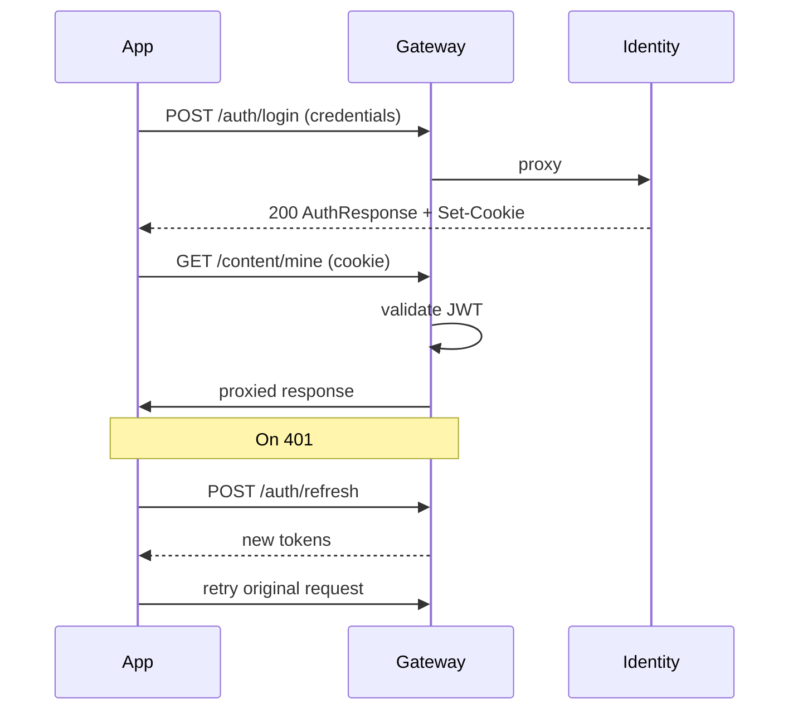
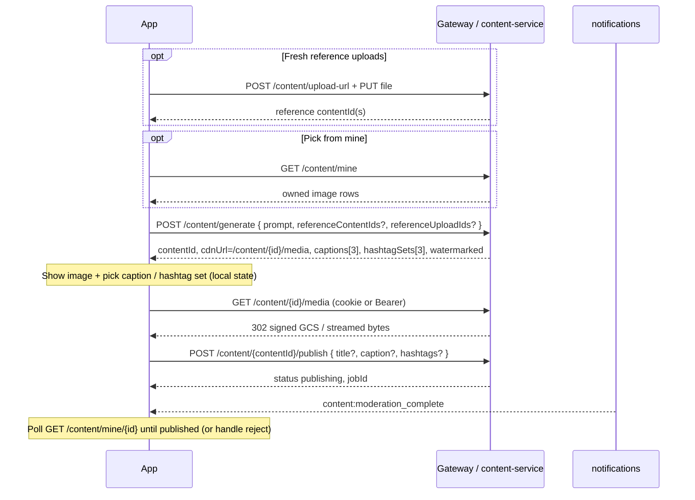
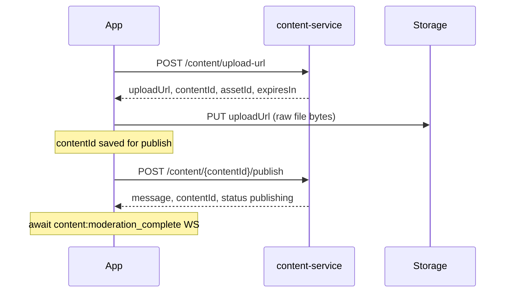
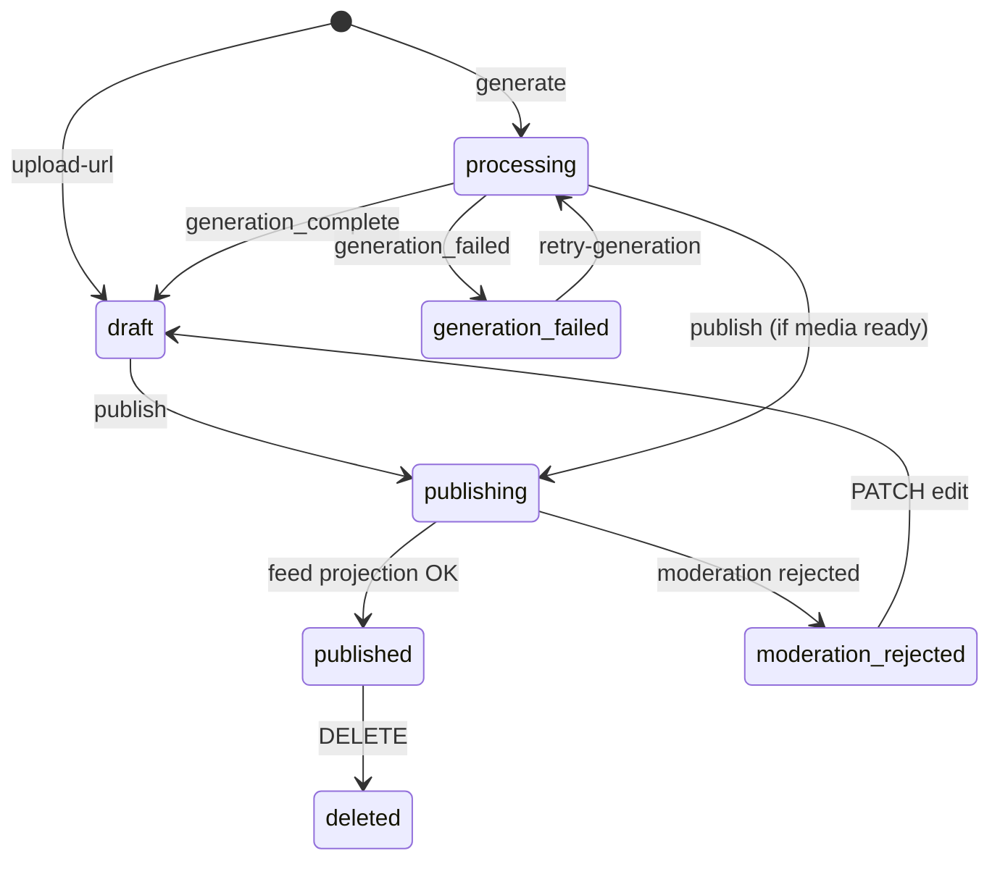

# nxClip Frontend Integration Guide

> **Audience:** Web and mobile client developers integrating with nxClip.  
> **Gateway base URL (local):** `http://localhost:5000`  
> **Gateway base URL (production example):** `https://api-gateway-216098834386.us-central1.run.app`  
> **Generated from implemented backend.** Exhaustive contracts and Postman e2e: [api-reference.md](./api-reference.md). This guide stays aligned with those flows for SPA/mobile implementation.

---

## Source of truth (Integration Doc vs this guide)

The **product Integration Document** is a UX / planning blueprint. **This guide + [api-reference.md](./api-reference.md)** describe what the running NestJS / .NET APIs actually implement. When they disagree, **ship against this guide / API Reference**.

| Area | Integration Doc said | Implemented reality (use this) | Priority if still changing |
|------|----------------------|--------------------------------|----------------------------|
| Auth tokens | Cookies only; no tokens in body | Cookies **and** `{ accessToken, refreshToken }` in body (SPA + Postman / mobile) | **Keep** — intentional hybrid |
| Email verification | Underspecified | Full loop + `GET /auth/dev/verification-token` in Development | **Keep** — already better |
| User / onboarding fields | Rich `gameNiche`, `WeekPlan` on `User` | `User` includes `onboardingCompleted` + `onboardingPlan` from DB (via `/auth/me`, `/users/me`) | **Done** |
| Image Studio generate | Sync `{ contentId, cdnUrl, captions[3], hashtagSets[3], watermarked }` | **Done** — Journey A (see §8–§9); `cdnUrl` is authenticated `/content/{id}/media`, not public GCS | Done |
| Create / update with references | — | **Done** — `referenceContentIds` / `referenceUploadIds` on generate; `POST /content/{id}/regenerate` for in-place edit | Done |
| Upload clip / asset | Separate upload journey | **Done** — Journey B: `upload-url` → `PUT` → `publish` (see §8) | Done |
| Creator Coach | Single fixed Q bank | **Done** — category picker + 5 category banks (`Gaming` / `General` / `Travel` / `Food` / `Cooking`); Redis resume (see §10) | Done |
| Upload-url names | `filename`, `contentType`, `fileSizeBytes` → `{ contentId }` | Accepts **both** naming styles; returns `contentId` + `assetId` + `expiresIn` | Done |
| Clip trim | `POST /content/:id/trim` | **Not implemented** | **P1** if Clip Trimmer (F6) is in MVP |
| Feed shape | Nested `engagement` + full `author` | Flat `likeCount`, `commentCount`, `likedByMe`, `userId` | **P2** — adapt client or add optional expand later |
| Pagination | `page` / `limit` | **Cursor** (`cursor` ISO + `limit`) everywhere | **Keep** — prefer cursor |
| Analytics | Charts / lock overlays / weekday series | Flat totals `{ views, likes, comments, followers, reach }` | **P2** — phase charts later |
| Notification prefs | Only list | `GET`/`PATCH /notifications/preferences` | **Keep** — richer than Integration Doc |

**Client rule of thumb:** treat Integration Doc as product intent for screens; treat this guide as the wire contract.

---

## Quick setup

```typescript
const API_BASE = import.meta.env.VITE_API_URL ?? 'http://localhost:5000';

const api = async (path: string, init: RequestInit = {}) => {
  const res = await fetch(`${API_BASE}${path}`, {
    ...init,
    credentials: 'include', // sends nx_access_token / nx_refresh_token cookies
    headers: {
      'Content-Type': 'application/json',
      'X-Correlation-Id': crypto.randomUUID(),
      ...init.headers,
    },
  });
  if (!res.ok) throw await res.json().catch(() => ({ statusCode: res.status }));
  return res.status === 204 ? null : res.json();
};
```

For Bearer-token clients (mobile, SSR without cookies), set `Authorization: Bearer <accessToken>` and manage refresh manually.

---

## 1. Authentication Flow

### Overview

nxClip uses **JWT access tokens** (1 hour) and **refresh tokens** (30 days). Identity-service issues both on register/login and can store them in **HTTP-only cookies**:

| Cookie | Purpose | Max-Age |
|--------|---------|---------|
| `nx_access_token` | Short-lived JWT | 1 hour |
| `nx_refresh_token` | Rotation refresh token | 30 days |

Cookie flags: `HttpOnly`, `SameSite=Lax`, `Secure` in production, `Path=/`.

The API gateway validates JWT on all routes except an explicit public allowlist. Valid requests are proxied upstream with `X-User-Id` set from the token `sub` claim.

### Registration

```
POST /auth/register
```

1. Client sends `RegisterRequest` (see Request DTOs).
2. Server responds `201` with `AuthResponse` (user + tokens).
3. Cookies are set automatically when using `credentials: 'include'`.
4. Store `user.id` in client state; tokens are in cookies or response body.

**Availability checks (optional UX):**

- `GET /auth/check-email?email=...` → `{ available: boolean }`
- `GET /auth/check-username?username=...` → `{ available: boolean }`

### Login

```
POST /auth/login
```

Same response shape as register. On `401` with `code: INVALID_CREDENTIALS`, show generic error. On `403` with `code: ACCOUNT_DISABLED`, block access.

### Session refresh

```
POST /auth/refresh
```

Body may be empty if `nx_refresh_token` cookie is present:

```json
{ "refreshToken": "optional-if-not-cookie" }
```

Response: `{ accessToken, refreshToken }`. Implement proactive refresh ~5 minutes before access token expiry, or retry once on `401` from the gateway.

### Logout

```
POST /auth/logout   (requires auth)
```

Returns `204`, revokes refresh token, clears cookies.

### Current user

Either endpoint returns the authenticated profile:

- `GET /auth/me`
- `GET /users/me`

### Email verification

```
POST /auth/verify-email
{ "token": "..." }
```

Returns `204` on success. Invalid token → `401` / `INVALID_VERIFICATION_TOKEN`.

### JWT claims (`JwtPayload`)

Decoded access token payload:

| Claim | Type | Use |
|-------|------|-----|
| `sub` | UUID | Current user ID |
| `email` | string | Display / analytics |
| `username` | string | Profile |
| `plan` | `FREE` \| `PRO` \| `STUDIO` | Feature gating in UI |
| `roles` | string[] | Admin features (if any) |
| `exp` | number | Refresh scheduling |

### Auth flow diagram



### Gateway public routes (no JWT)

| Method | Path |
|--------|------|
| POST | `/auth/register`, `/auth/login`, `/auth/refresh` |
| GET | `/auth/check-email`, `/auth/check-username` |
| POST | `/billing/webhook` |

All other gateway routes require a valid JWT (cookie or Bearer).

---

## 2. API Endpoints

All paths below are relative to the **gateway** (`http://localhost:5000`) unless noted.

### Identity (`/auth`, `/users`)

| Method | Path | Auth | Description |
|--------|------|------|-------------|
| POST | `/auth/register` | Public | Create account |
| POST | `/auth/login` | Public | Sign in |
| POST | `/auth/refresh` | Public | Rotate tokens |
| POST | `/auth/logout` | JWT | Sign out |
| GET | `/auth/me` | JWT | Current user |
| GET | `/auth/check-email` | Public | Email availability |
| GET | `/auth/check-username` | Public | Username availability |
| POST | `/auth/verify-email` | Public | Confirm email |
| GET | `/users/me` | JWT | Profile (same as `/auth/me`) |
| PATCH | `/users/me` | JWT | Update profile |
| GET | `/users/{id}` | Public | Public profile by ID |

### Content (`/content`)

Two create journeys share the same publish → moderation → feed path. See [api-reference.md — Content Service](./api-reference.md#content-service).

| Method | Path | Auth | Description |
|--------|------|------|-------------|
| POST | `/content/upload-url` | JWT | **Journey B** — presigned upload URL (creates `draft`); also used for **fresh reference uploads** |
| POST | `/content/generate` | JWT | **Journey A** — Image Studio sync generate (± `referenceContentIds` / `referenceUploadIds`) |
| POST | `/content/{id}/regenerate` | JWT | **Journey A3** — in-place update for `draft` / `moderation_rejected` (base image + optional prompt/refs) |
| GET | `/content/{id}/media` | JWT | Authenticated media (302 to GCS signed GET / local stream). Owner: any status; others: `published` only |
| GET | `/content` | Public | List **published** only (discovery; not required for create) |
| GET | `/content/mine` | JWT | Library / status polling / **reference picker** |
| GET | `/content/mine/{id}` | JWT | Owned item in any non-deleted status (use while `draft` / `publishing`) |
| GET | `/content/{id}` | Public | **Published only** — `404` while still `publishing` / `draft` |
| PATCH | `/content/{id}` | JWT | Edit after moderation rejection only → returns to `draft` |
| POST | `/content/{id}/retry-generation` | JWT | Retry when `generation_failed` (no new prompt/refs) |
| POST | `/content/{id}/publish` | JWT | Submit for moderation → `publishing` |
| DELETE | `/content/{id}` | JWT | Soft delete (`204`) |

### Creator Coach (`/coach/onboarding`)

| Method | Path | Auth | Description |
|--------|------|------|-------------|
| POST | `/coach/onboarding/start` | JWT | Start or resume; optional `{ category, reset }` — category picker is `question: 0` |
| GET | `/coach/onboarding/status` | JWT | Resume snapshot after refresh (Redis ~7 days) |
| POST | `/coach/onboarding/answer` | JWT | Answer category (`question: 0`) or Q1–Q5 |
| POST | `/coach/onboarding/generate-plan` | JWT | After Q5 (`ready_for_plan`) — persists plan + `onboardingCompleted` |

Connect Socket.IO before coach calls to receive `coach:token` / `coach:progress` / `onboarding:complete`. Dev page: `{GATEWAY}/dev/coach-ws`.

### Feed (`/feed` via gateway)

| Method | Path | Auth | Description |
|--------|------|------|-------------|
| GET | `/feed` | JWT | Personalized feed |
| GET | `/feed/trending` | Public* | Discovery feed |
| GET | `/feed/{id}` | Public* | Single feed projection |

\*Optional JWT enriches `likedByMe` / `isFollowing`.

### Feed engagement & social (feed-service direct)

> **Important:** Like, comment, and follow routes live on **feed-service** at paths `/content/...` and `/users/...`. The gateway currently routes `/content` → content-service and `/users` → identity-service, so these calls **do not work through the gateway** until path splitting is added.

**Use feed-service base URL for now:** `http://localhost:5003`

| Method | Path | Auth | Description |
|--------|------|------|-------------|
| POST | `/content/{id}/like` | JWT | Like (idempotent) |
| POST | `/content/{id}/comment` | JWT | Add comment |
| GET | `/content/{id}/comments` | Public | List comments |
| POST | `/users/{id}/follow` | JWT | Follow user |
| GET | `/users/{id}/profile` | Public* | Follower counts |

### Analytics (`/analytics`)

| Method | Path | Auth | Description |
|--------|------|------|-------------|
| POST | `/analytics/events` | JWT | Ingest client event |
| GET | `/analytics/metrics` | JWT | Dashboard metrics |
| GET | `/analytics/report/latest` | JWT | Latest weekly report |

### Notifications (`/notifications`)

| Method | Path | Auth | Description |
|--------|------|------|-------------|
| POST | `/notifications/register-token` | JWT | Register push token |
| GET | `/notifications` | JWT | Notification history |
| GET | `/notifications/preferences` | JWT | Get preferences |
| PATCH | `/notifications/preferences` | JWT | Update preferences |
| PATCH | `/notifications/{id}/read` | JWT | Mark read |

### Real-time (notification-service)

| Transport | URL | Auth |
|-----------|-----|------|
| Socket.IO | `ws://localhost:5006/events` | JWT (see WebSocket section) |

---

## 3. Request DTOs

### Auth & users

**`RegisterRequest`**

```typescript
interface RegisterRequest {
  email: string;       // valid email, max 255
  username: string;    // 3–64, ^[a-zA-Z0-9_]+$
  displayName: string; // max 100
  password: string;    // 8–128
}
```

**`LoginRequest`**

```typescript
interface LoginRequest {
  email: string;
  password: string;
}
```

**`RefreshTokenRequest`**

```typescript
interface RefreshTokenRequest {
  refreshToken?: string; // optional if cookie present
}
```

**`VerifyEmailRequest`**

```typescript
interface VerifyEmailRequest {
  token: string;
}
```

**`UpdateProfileRequest`** (all fields optional, at least one expected)

```typescript
interface UpdateProfileRequest {
  displayName?: string; // max 100
  bio?: string;         // max 200
  avatarUrl?: string;   // max 500
}
```

### Content

**`UploadUrlRequest`**

```typescript
interface UploadUrlRequest {
  fileName: string;  // max 512
  mimeType: string;  // valid MIME
  fileSize: number;  // 1 – 104_857_600 (100 MB)
}
```

**`GenerateImageRequest`**

```typescript
interface GenerateImageRequest {
  prompt: string;                    // 3–2000 chars
  style?: string;                    // max 64
  aspectRatio?: '1:1' | '16:9' | '9:16';
  model?: string;                    // max 64
  /** Owned image content ids from GET /content/mine */
  referenceContentIds?: string[];
  /** contentId from upload-url + PUT (fresh reference uploads) */
  referenceUploadIds?: string[];
}
```

**`RegenerateImageRequest`**

```typescript
interface RegenerateImageRequest {
  prompt?: string;                   // omit to reuse stored prompt
  style?: string;
  aspectRatio?: '1:1' | '16:9' | '9:16';
  model?: string;
  referenceContentIds?: string[];
  referenceUploadIds?: string[];
}
```

**`UpdateContentRequest`** (at least one field required; only when `status === moderation_rejected`)

```typescript
interface UpdateContentRequest {
  title?: string;       // max 200; required if description omitted
  description?: string; // max 5000; required if title omitted
}
```

**`PublishContentRequest`**

```typescript
interface PublishContentRequest {
  caption?: string;
  hashtags?: string[];
  title?: string;
  description?: string;
}
```

### Creator Coach

**`CoachStartRequest`**

```typescript
interface CoachStartRequest {
  category?: 'Gaming' | 'General' | 'Travel' | 'Food' | 'Cooking'; // or case-insensitive label
  reset?: boolean; // true = clear Redis progress then start
}
```

**`CoachAnswerRequest`**

```typescript
interface CoachAnswerRequest {
  question: number;              // 0 = category; 1–5 = bank questions
  answer: string | string[];     // string for category / Q2–Q5; string[] for multi-select Q1
}
```

### Feed

**`CreateCommentRequest`**

```typescript
interface CreateCommentRequest {
  body: string; // 1–2000 chars
}
```

**`RegisterTokenRequest`**

```typescript
interface RegisterTokenRequest {
  token: string;              // 10–512 chars
  platform?: 'web' | 'ios' | 'android';
}
```

**`UpdateNotificationPreferencesRequest`** (all optional)

```typescript
interface UpdateNotificationPreferencesRequest {
  pushEnabled?: boolean;
  inAppEnabled?: boolean;
  eventPreferences?: Record<string, boolean>;
}
```

### Analytics

**`IngestEventRequest`**

```typescript
type AnalyticsEventType =
  | 'VIEW'
  | 'LIKE'
  | 'COMMENT'
  | 'FOLLOW'
  | 'SHARE'
  | 'CONTENT_PUBLISHED';

interface IngestEventRequest {
  eventType: AnalyticsEventType;
  contentId: string;   // UUID
  userId?: string;     // UUID, optional
  occurredAt?: string; // ISO 8601
}
```

### Pagination query (shared pattern)

```typescript
interface CursorQuery {
  cursor?: string; // ISO 8601 datetime from previous nextCursor
  limit?: number;  // see Pagination section for per-endpoint max
}
```

---

## 4. Response DTOs

### Auth

**`User`**

```typescript
interface User {
  id: string;
  email: string;
  username: string;
  displayName: string;
  plan: 'FREE' | 'PRO' | 'STUDIO';
  emailVerified: boolean;
  roles: string[];
  createdAt: string; // ISO 8601
  /** True after Creator Coach generate-plan has been saved */
  onboardingCompleted: boolean;
  /** Persisted plan JSON, or null until onboarding finishes */
  onboardingPlan: Record<string, unknown> | null;
}
```

Use `GET /auth/me` or `GET /users/me` after login / refresh to decide whether to show Creator Coach or Plan Reveal (full coach flow: §10):

```typescript
const me = await api('/auth/me');
if (!me.onboardingCompleted) {
  // route to /onboarding (Creator Coach — category picker + 5 questions)
} else {
  // show dashboard with me.onboardingPlan
}
```

**`AuthResponse`**

```typescript
interface AuthResponse {
  user: User;
  accessToken: string;
  refreshToken: string;
}
```

**`TokenResponse`**

```typescript
interface TokenResponse {
  accessToken: string;
  refreshToken: string;
}
```

**`AvailabilityResponse`**

```typescript
interface AvailabilityResponse {
  available: boolean;
}
```

### Content

**`Content`**

```typescript
type ContentStatus =
  | 'draft'
  | 'processing'
  | 'generation_failed'
  | 'publishing'
  | 'moderation_rejected'
  | 'published'
  | 'deleted';

type ContentType = 'image' | 'clip';

interface Content {
  id: string;
  userId: string;
  title: string;
  description: string;
  status: ContentStatus;
  contentType: ContentType;
  cdnUrl: string;
  thumbnailUrl: string;
  /** Present after Image Studio generation */
  captions?: string[];
  /** Present after Image Studio generation — exactly 3 bundles when generated */
  hashtagSets?: string[][];
  watermarked: boolean;
  createdAt: string;
}
```

**`ContentListResponse`**

```typescript
interface ContentListResponse {
  items: Content[];
  nextCursor?: string;
}
```

**`UploadUrlResponse`**

```typescript
interface UploadUrlResponse {
  uploadUrl: string;
  contentId: string; // canonical content ID
  assetId: string;   // alias of contentId (backwards compatible)
  expiresIn: number; // seconds (default 3600)
}
```

**`GenerateImageResponse`** (Image Studio — sync)

```typescript
interface GenerateImageResponse {
  contentId: string;
  cdnUrl: string;
  thumbnailUrl: string;
  captions: string[];       // exactly 3
  hashtagSets: string[][];  // exactly 3 bundles
  watermarked: boolean;
}
```

> Image Studio generation runs **inline**. Prefer rendering from this HTTP response. `cdnUrl` / `thumbnailUrl` are **authenticated media routes** (`{gateway}/content/{id}/media`), not permanent public GCS URLs. WebSocket `content:generation_complete` is still useful to refresh `GET /content/mine`.

**`PublishContentResponse`**

```typescript
interface PublishContentResponse {
  message: string;
  contentId: string;
  jobId?: string;           // moderation job id — keep if debugging stuck publishing
  status?: 'publishing';
}
```

**`CoachQuestionResponse`**

```typescript
interface CoachQuestionResponse {
  message: string;
  question: number;           // 0 = category picker; 1–5 = content questions
  category: string | null;
  chips: string[];
  chipLabels?: string[];      // friendly labels for category picker
  multiSelect: boolean;
  totalQuestions: number;     // always 5 after category chosen
  answeredCount: number;
  status: 'category' | 'in_progress' | 'ready_for_plan';
}
```

**`CoachStatusResponse`** (simplified)

```typescript
interface CoachStatusResponse {
  status: 'not_started' | 'category' | 'in_progress' | 'ready_for_plan' | 'completed';
  category: string | null;
  nextQuestion?: number;
  answeredCount: number;
  totalQuestions: number;
  answers?: Record<string, string | string[]>;
  categories?: { id: string; label: string }[];
  question?: CoachQuestionResponse;
}
```

**`CoachPlanResponse`**

```typescript
interface CoachPlanResponse {
  message: string;
  category: string;
  onboardingCompleted: true;
  plan: {
    introMessage: string;
    days: Array<{ day: string; icon?: string; contentType?: string; theme?: string }>; // length 7
    recommendedHashtags: string[];
    workspaceTheme?: { primaryColor?: string; motivationalQuote?: string };
    customSystemPromptSuggestion?: string;
  };
}
```

### Feed

**`FeedItem`**

```typescript
interface FeedItem {
  id: string;           // feed projection ID (not content ID)
  contentId: string;
  userId: string;
  title: string;
  description: string;
  contentType: string;
  thumbnailUrl: string;
  likeCount: number;
  commentCount: number;
  likedByMe: boolean;
  publishedAt: string;
}
```

**`FeedListResponse`**

```typescript
interface FeedListResponse {
  items: FeedItem[];
  nextCursor?: string;
}
```

**`LikeResponse`**

```typescript
interface LikeResponse {
  contentId: string;
  liked: boolean;
  likeCount: number;
}
```

**`Comment`**

```typescript
interface Comment {
  id: string;
  userId: string;
  contentId: string;
  body: string;
  createdAt: string;
}
```

**`CommentListResponse`**

```typescript
interface CommentListResponse {
  items: Comment[];
  nextCursor?: string;
}
```

**`FollowResponse`**

```typescript
interface FollowResponse {
  userId: string;
  following: boolean;
  followerCount: number;
}
```

**`UserProfile`**

```typescript
interface UserProfile {
  userId: string;
  followerCount: number;
  followingCount: number;
  isFollowing: boolean;
}
```

### Notifications

**`Notification`**

```typescript
interface Notification {
  id: string;
  eventName: string;
  payload: Record<string, unknown>;
  readAt?: string;
  createdAt: string;
}
```

**`NotificationListResponse`**

```typescript
interface NotificationListResponse {
  items: Notification[];
  nextCursor?: string;
}
```

**`NotificationPreferences`**

```typescript
interface NotificationPreferences {
  pushEnabled: boolean;
  inAppEnabled: boolean;
  eventPreferences: Record<string, boolean>;
}
```

### Analytics

**`IngestEventResponse`**

```typescript
interface IngestEventResponse {
  eventId: string;
  status: 'accepted';
}
```

**`DashboardMetrics`**

```typescript
interface DashboardMetrics {
  views: number;
  likes: number;
  comments: number;
  followers: number;
  reach: number;
}
```

**`WeeklyReport`**

```typescript
interface WeeklyReport {
  reportId: string;
  userId: string;
  periodStart: string;
  periodEnd: string;
  views: number;
  likes: number;
  comments: number;
  followers: number;
  growthRate: number;
}
```

---

## 5. WebSocket Events

### Connection

Use **Socket.IO** client against notification-service:

```typescript
import { io } from 'socket.io-client';

const socket = io('http://localhost:5006/events', {
  auth: { token: accessToken },           // preferred for SPAs with Bearer
  // OR rely on nx_access_token cookie with withCredentials
  withCredentials: true,
  transports: ['websocket'],
});
```

**Authentication sources** (first match wins):

1. `Authorization: Bearer <token>` header on handshake
2. `auth.token` in Socket.IO handshake
3. Cookie `nx_access_token`

Invalid or missing token → connection closed immediately.

### Room model

On success, the server joins the socket to `user:{userId}` (from JWT `sub`). Events are user-scoped only.

### Message format

The server emits the **event name as the Socket.IO event type**:

```typescript
socket.on('content:generation_complete', (data) => {
  // data shape below + notificationId
});
```

Every payload includes `notificationId` (UUID) prepended by the gateway:

```typescript
interface WebSocketEnvelope<T> {
  notificationId: string;
  // ...event-specific fields
}
```

### Supported events

| Event | Typical payload fields | When to update UI |
|-------|------------------------|-------------------|
| `coach:token` | `token` | Stream Creator Coach message text (append tokens) |
| `coach:progress` | `message` | Progress toast / “Question N/5 saved” / plan generation |
| `onboarding:complete` | `userId`, `message` | Leave onboarding; refresh `/auth/me` for `onboardingCompleted` + plan |
| `content:processing` | `contentId`, `progress` | Optional progress (Image Studio is usually sync) |
| `content:generation_complete` | `contentId`, `assetUrl` | Invalidate `content/mine`; Image Studio already has HTTP response |
| `content:generation_failed` | `contentId`, `reason`, `retryable` | Show retry CTA → `POST .../retry-generation` |
| `content:moderation_complete` | `contentId`, `status: 'approved' \| 'rejected'` | Publish flow feedback — then poll `/content/mine/{id}` until `published` (approve) or handle reject |
| `content:transcribing` | (progress) | Clip processing |
| `content:transcription_complete` | `contentId`, `transcriptId` | Captions UI |
| `content:captions_ready` | `contentId` | Clip editor (not Image Studio captions) |
| `content:polish_complete` | `contentId` | Editor |
| `analytics:report_ready` | `reportId` | Dashboard badge |
| `billing:subscription_changed` | `plan` | Refresh plan-gated UI |

**Dev WebSocket page (gateway):** `{GATEWAY}/dev/coach-ws` — paste the same JWT as Postman/SPA; logs coach **and** content events. Production example: `https://api-gateway-….run.app/dev/coach-ws`.

### Client integration pattern

```typescript
const CONTENT_EVENTS = [
  'content:processing',
  'content:generation_complete',
  'content:generation_failed',
  'content:moderation_complete',
] as const;

for (const event of CONTENT_EVENTS) {
  socket.on(event, (payload) => {
    queryClient.invalidateQueries({ queryKey: ['content', payload.contentId] });
    queryClient.invalidateQueries({ queryKey: ['content', 'mine'] });
  });
}

socket.on('coach:token', ({ token }) => appendCoachText(token));
socket.on('coach:progress', ({ message }) => showCoachProgress(message));
socket.on('onboarding:complete', async () => {
  await queryClient.invalidateQueries({ queryKey: ['auth', 'me'] });
  navigate('/dashboard');
});
```

Respect user preferences from `GET /notifications/preferences` — disabled events may still be logged server-side but not pushed in-app.

---

## 6. Error Handling

### Error shapes by layer

**NestJS services** (content, feed, notification) — validation:

```json
{
  "statusCode": 400,
  "message": ["prompt must be longer than or equal to 3 characters"],
  "error": "Bad Request"
}
```

**API Gateway** (`GatewayExceptionFilter`):

```json
{
  "statusCode": 401,
  "message": "Authentication required",
  "correlationId": "uuid",
  "path": "/content/generate",
  "timestamp": "2026-06-11T12:00:00.000Z"
}
```

**Identity & Analytics** (domain errors):

```json
{
  "statusCode": 409,
  "message": "Email already registered",
  "code": "EMAIL_EXISTS"
}
```

### Recommended client handler

```typescript
type ApiError = {
  statusCode: number;
  message: string | string[];
  code?: string;
  correlationId?: string;
};

async function handleResponse(res: Response) {
  if (res.ok) return res.status === 204 ? null : res.json();

  const err: ApiError = await res.json().catch(() => ({
    statusCode: res.status,
    message: res.statusText,
  }));

  if (res.status === 401 && !err.code) {
    // gateway JWT failure — try refresh once
    await refreshSession();
    throw new RetryableError(err);
  }

  throw new AppError(err);
}
```

### HTTP status reference

| Status | Meaning | Client action |
|--------|---------|---------------|
| `400` | Validation or invalid state | Show field errors or state message |
| `401` | Unauthenticated | Refresh token or redirect to login |
| `403` | Forbidden / plan limit | Show upgrade or ownership error |
| `404` | Not found | Remove stale UI item |
| `409` | Conflict (email/username) | Inline form error |
| `429` | Rate limited (gateway) | Back off and retry |
| `502` | Upstream down | Retry with exponential backoff |

### Identity `code` values

| `code` | HTTP |
|--------|------|
| `EMAIL_EXISTS` | 409 |
| `USERNAME_EXISTS` | 409 |
| `INVALID_CREDENTIALS` | 401 |
| `INVALID_REFRESH_TOKEN` | 401 → force re-login |
| `INVALID_VERIFICATION_TOKEN` | 401 |
| `USER_NOT_FOUND` | 404 |
| `ACCOUNT_DISABLED` | 403 |

### Content-specific errors

| Condition | HTTP | UI hint |
|-----------|------|---------|
| `InvalidContentStateException` | 400 | Wrong button for current status |
| `ContentForbiddenException` | 403 | Not owner |
| `ContentNotFoundException` | 404 | Item removed |
| `InvalidPlanException` | 403 | Daily limit (upload 20 / generate 10 on FREE) |

### Correlation ID

Send `X-Correlation-Id: <uuid>` on requests for support debugging. Gateway echoes it in error responses.

---

## 7. Pagination

All list endpoints use **cursor-based** pagination (not offset).

### Request

| Endpoint | `limit` default | `limit` max |
|----------|-----------------|-------------|
| `GET /content`, `/content/mine` | 20 | 100 |
| `GET /feed`, `/feed/trending` | 20 | 50 |
| `GET /content/{id}/comments` | 20 | 50 |
| `GET /notifications` | 20 | 100 |

```typescript
// First page
const page1 = await api('/content?limit=20');

// Next page
if (page1.nextCursor) {
  const page2 = await api(
    `/content?limit=20&cursor=${encodeURIComponent(page1.nextCursor)}`,
  );
}
```

### Response

```typescript
interface Paginated<T> {
  items: T[];
  nextCursor?: string; // ISO 8601 — omit when no more pages
}
```

### Client pattern (infinite scroll)

```typescript
function useInfiniteList(path: string) {
  return useInfiniteQuery({
    queryKey: [path],
    queryFn: ({ pageParam }) =>
      api(pageParam ? `${path}?cursor=${encodeURIComponent(pageParam)}` : path),
    getNextPageParam: (last) => last.nextCursor ?? undefined,
    initialPageParam: undefined as string | undefined,
  });
}
```

**Do not** reuse cursors across filter changes. Reset pagination when sort or filter changes.

---

## 8. Content create journeys

Both journeys end the same way: `POST /content/{id}/publish` → `publishing` → WebSocket `content:moderation_complete` → feed projection → `published`.

| Journey | Entry | Initial status after success | Media source |
|---------|-------|------------------------------|--------------|
| **A — Image Studio** | `POST /content/generate` | `draft` (sync) | AI-generated image + captions |
| **A2 — Create with references** | `generate` + mine and/or upload refs | `draft` | Prompt + owned reference images |
| **A3 — Update existing** | `POST /content/{id}/regenerate` | same id → `draft` | Current image as base ± prompt ± refs |
| **B — Upload clip / asset** | `POST /content/upload-url` + `PUT` file | `draft` | User-uploaded bytes |

**Minimum Image Studio path:** generate → render via `/content/{id}/media` → publish → await moderation WS.  
`GET /content/mine` is required when picking references from library.

> **`GET /content/{id}` returns 404 until `published`.** While `draft` / `publishing`, use `GET /content/mine/{id}`.

### How to pick existing references

References are **owned** content only — not other users’ feed posts.

```text
Add reference
  ├─ Upload new → POST /content/upload-url → PUT file → use contentId in referenceUploadIds
  └─ From my library → GET /content/mine → grid of thumbnails via /content/{id}/media
                        → multi-select image rows → referenceContentIds
```

| Plan | Max extra reference ids (combined) |
|------|-------------------------------------|
| FREE | 2 |
| PRO+ | 4 |

On **regenerate**, the target’s current image is always sent as multimodal **base** (does not consume the extra-ref quota).

---

### Journey A — Image Studio (generate → publish)



```typescript
// Optional: upload a reference first (reuse Journey B storage)
const up = await api<UploadUrlResponse>('/content/upload-url', {
  method: 'POST',
  body: JSON.stringify({
    fileName: 'ref.png',
    mimeType: 'image/png',
    fileSize: file.size,
  }),
});
await fetch(up.uploadUrl, { method: 'PUT', headers: { 'Content-Type': file.type }, body: file });

// Optional: pick from library
const mine = await api<{ items: Content[] }>('/content/mine');
const fromMine = mine.items.filter((c) => c.contentType === 'image').slice(0, 1).map((c) => c.id);

// 1. Generate (sync — show skeleton until response)
const studio = await api<GenerateImageResponse>('/content/generate', {
  method: 'POST',
  body: JSON.stringify({
    prompt,
    style: 'cinematic',
    aspectRatio: '16:9',
    referenceUploadIds: [up.contentId],
    referenceContentIds: fromMine,
  }),
});

// 2. Render from HTTP response (preferred over waiting for WS)
setCaptions(studio.captions);
setHashtagSets(studio.hashtagSets);
setWatermarked(studio.watermarked);

// Same-origin SPA + cookies:  works.
// Cross-origin SPA: fetch with Authorization and use a blob URL:
const mediaRes = await fetch(studio.cdnUrl, {
  headers: { Authorization: `Bearer ${accessToken}` },
  credentials: 'include',
});
// follow redirect or use blob — do not treat cdnUrl as a permanent public CDN

// Optional: keep library in sync
socket.on('content:generation_complete', () => {
  queryClient.invalidateQueries({ queryKey: ['content', 'mine'] });
});
socket.on('content:generation_failed', ({ reason, retryable }) => {
  showError(reason, retryable);
});

// 3. Publish with selected caption / hashtags
await api(`/content/${studio.contentId}/publish`, {
  method: 'POST',
  body: JSON.stringify({
    title: 'Mountain Sunset',
    caption: selectedCaption,
    hashtags: selectedHashtagSet,
  }),
});
```

**Statuses (Image Studio):**

```text
[*] --generate(+optional refs)--> processing --inline success--> draft --publish--> publishing --feed OK--> published
processing --fail--> generation_failed --retry-generation--> processing
draft --regenerate(+optional refs)--> processing --> draft
publishing --reject--> moderation_rejected --PATCH or regenerate--> draft --publish--> …
```

### Journey A3 — Update existing image (`regenerate`)

Allowed when status is `draft` or `moderation_rejected` and media exists. **Same `contentId`**; media overwritten in place. Counts as a generation toward the daily limit.

```typescript
// Prompt-only edit (current image is always the multimodal base)
const updated = await api<GenerateImageResponse>(`/content/${contentId}/regenerate`, {
  method: 'POST',
  body: JSON.stringify({ prompt: 'Same subject, neon cyberpunk city' }),
});

// Prompt + extra mine / upload refs
await api(`/content/${contentId}/regenerate`, {
  method: 'POST',
  body: JSON.stringify({
    prompt: 'Blend style from these refs',
    referenceContentIds: fromMine,
    referenceUploadIds: [up.contentId],
  }),
});

// Then publish as usual
await api(`/content/${contentId}/publish`, { method: 'POST', body: JSON.stringify({ … }) });
```

| Do | Don’t |
|----|-------|
| Use regenerate on drafts before publish | Expect regenerate on `published` (not MVP) |
| Use `retry-generation` only for `generation_failed` | Send a new prompt to retry-generation (no body) |
| Pick refs from **mine** / own uploads | Pick other users’ feed posts |

---

### Journey B — Upload clip / asset (upload → publish)



#### Step 1 — Request presigned URL

```http
POST /content/upload-url
Authorization: Bearer …
Content-Type: application/json

{
  "fileName": "clip.mp4",
  "mimeType": "video/mp4",
  "fileSize": 5242880
}
```

Aliases also accepted: `filename`, `contentType`, `fileSizeBytes`. Prefer either style; both work.

Response:

```json
{
  "uploadUrl": "https://storage.example/upload/...",
  "contentId": "550e8400-e29b-41d4-a716-446655440000",
  "assetId": "550e8400-e29b-41d4-a716-446655440000",
  "expiresIn": 3600
}
```

`contentId` / `assetId` is the **content record ID**. Persist it before uploading.

#### Step 2 — Upload file to storage

```typescript
await fetch(uploadUrl, {
  method: 'PUT',
  headers: { 'Content-Type': mimeType },
  body: file,
});
```

Local dev may use content-service-hosted upload URLs (`/storage/upload/...`). Production uses presigned object storage URLs. No separate “complete upload” API — the content row is created in `draft` with `storageKey` pre-assigned.

#### Step 3 — Publish (when user is ready)

```http
POST /content/{contentId}/publish
Content-Type: application/json

{
  "title": "My clip",
  "caption": "Optional caption",
  "hashtags": ["#NxClip"],
  "description": "Optional longer description"
}
```

Preconditions: status `draft` or `processing`, media present (`storageKey` set at upload-url time).

Response:

```json
{
  "message": "Content submitted for moderation",
  "contentId": "550e8400-e29b-41d4-a716-446655440000",
  "jobId": "…",
  "status": "publishing"
}
```

---

### Plan limits (FREE)

| Action | Daily limit |
|--------|-------------|
| Upload URL creation | 20 |
| AI generation | 10 |

Exceeded → `403`:

```json
{
  "statusCode": 403,
  "message": "Free plan daily image generation limit (10) reached",
  "current": 10,
  "limit": 10,
  "upgrade_url": "/billing/create-checkout",
  "required_plan": "pro"
}
```

### Upload vs AI generation

| Path | Entry | Initial status | After success | Content type |
|------|-------|----------------|---------------|--------------|
| Upload | `POST /content/upload-url` | `draft` | still `draft` until publish | `image` or `clip` from MIME |
| AI generate | `POST /content/generate` | `processing` | `draft` (inline) with media route + captions | `image` |

---

## 9. Content Lifecycle

### Status values

| Status | User-visible meaning | Allowed actions |
|--------|---------------------|-----------------|
| `draft` | Ready to edit/publish | Publish, delete |
| `processing` | AI working | Wait; WebSocket progress |
| `generation_failed` | AI failed | `POST .../retry-generation` if `retryable` |
| `publishing` | Moderation + feed sync | Wait; no edit — track via `/content/mine/{id}` |
| `moderation_rejected` | Policy rejection | `PATCH ...` title/description → becomes `draft` |
| `published` | Live in feed | `GET /content/{id}`, feed; delete |
| `deleted` | Removed | Hidden from lists |

### State machine



### Publish pipeline (async)

1. **Client:** `POST /content/{id}/publish` with optional `{ caption, hashtags, title, description }` → `{ message, contentId, jobId?, status: "publishing" }`.
2. **Backend:** Requests AI moderation (inline on Cloud Run).
3. **On approval:** Content stays `publishing`; outbox dispatches feed projection + analytics + notification.
4. **On feed success:** Status becomes `published` (only after feed projection succeeds).
5. **On rejection:** Status → `moderation_rejected`; WebSocket `content:moderation_complete` with `status: "rejected"`.

`published` in the API means **feed projection succeeded**, not merely “user clicked publish”. After `approved`, keep showing a publishing state until `GET /content/mine/{id}` returns `published` (or invalidate library on a short poll).

### Frontend screens mapping

| Screen | Poll / subscribe | Key endpoints |
|--------|------------------|---------------|
| Image Studio (`/create/image`) | Optional `content:generation_*` | **Required:** `POST /content/generate` (± refs) → load media → publish. Optional: upload-url for refs; `GET /content/mine` for picker |
| Edit draft image | Optional `content:generation_*` | `POST /content/{id}/regenerate` then publish |
| Upload / clip create | `content:moderation_complete` | `POST /content/upload-url` → `PUT` → publish |
| My content library | `content:generation_*`, `content:moderation_complete` | `GET /content/mine`, `GET /content/mine/{id}` |
| Editor (rejected) | — | `PATCH /content/{id}` and/or `regenerate`, then re-publish |
| Generation failure | `content:generation_failed` | `POST /content/{id}/retry-generation` |
| Public detail | — | `GET /content/{id}` (**published only**) |
| Feed | — | `GET /feed` (+ media with JWT for thumbnails) |
| Post-publish waiting | `content:moderation_complete` | Show `publishing` badge; poll mine until `published` |
| Soft delete | — | `DELETE /content/{id}` |

### Loading authenticated media

| Client | How to show `cdnUrl` |
|--------|----------------------|
| SPA on **same origin** as gateway + cookies | `` or `<video src={cdnUrl} />` |
| SPA on **another origin** / Bearer-only | `fetch(cdnUrl, { headers: { Authorization }, credentials: 'include' })` → blob URL |
| Owner | Allowed for draft / publishing / published / rejected |
| Other users | Only when status is **`published`** |

### Moderation rejection flow

```typescript
// After content:moderation_complete with status rejected
await api(`/content/${id}`, {
  method: 'PATCH',
  body: JSON.stringify({ title: 'Updated title' }),
});
// Response status is now draft — user can fix and publish again
await api(`/content/${id}/publish`, {
  method: 'POST',
  body: JSON.stringify({ title: 'Updated title', caption: 'Retry caption' }),
});
```

### Retry generation

```http
POST /content/{id}/retry-generation
```

Only valid when `status === generation_failed` and prompt exists on the content record.  
**Response:** same Image Studio shape as `POST /content/generate`.

---

## 10. Creator Coach onboarding

Interactive onboarding via gateway `/coach/onboarding/*` + Socket.IO. Full contract: [api-reference — Creator Coach](./api-reference.md#creator-coach-onboarding-jwt). UX steps: [AI-INTEGRATIONS.md §11](./AI-INTEGRATIONS.md#11-interactive-creator-coach-onboarding-flow-specifications).

### Categories (question banks)

| Id | Label |
|----|-------|
| `Gaming` | Gaming |
| `General` | General Content / Lifestyle |
| `Travel` | Travel / Adventure |
| `Food` | Food / Dining / Reviews |
| `Cooking` | Cooking / Recipes / DIY Baking |

After category selection, the SPA runs **5** category-specific questions (Q1 multi-select niches; Q2–Q5 single-select). Banks are DB-seeded; progress lives in **Redis** (~7 days).

### Client flow

| Step | Client | API | UI |
|------|--------|-----|----|
| 0 | Connect WS; optional `GET /coach/onboarding/status` | Resume if in progress | If `not_started` / `category`: show picker |
| 1 | `POST /coach/onboarding/start` `{}` or `{ category }` | Picker (`question: 0`) or Q1 | Chips + `chipLabels` for categories |
| 2 | `POST .../answer` `{ question: 0, answer: "Travel" }` | Opens Travel bank | Progress 1–5 begins |
| 3–6 | Answer Q1–Q5 | Next question / `ready_for_plan` | Stream `coach:token`; toast on `coach:progress` |
| 7 | `POST .../generate-plan` | Plan + `onboardingCompleted: true` | Show 7-day cards; navigate dashboard |

```typescript
// Connect /dev/coach-ws or Socket.IO before HTTP calls
const start = await api<CoachQuestionResponse>('/coach/onboarding/start', {
  method: 'POST',
  body: JSON.stringify({}), // or { category: 'Travel', reset: true }
});

if (start.status === 'category') {
  // render start.chips / start.chipLabels — on pick:
  await api('/coach/onboarding/answer', {
    method: 'POST',
    body: JSON.stringify({ question: 0, answer: 'Travel' }),
  });
}

// Q1 multi-select example
await api('/coach/onboarding/answer', {
  method: 'POST',
  body: JSON.stringify({
    question: 1,
    answer: ['Solo Backpacking', 'Budget Travel Hacks'],
  }),
});

// After Q5 → status ready_for_plan
const planRes = await api<CoachPlanResponse>('/coach/onboarding/generate-plan', {
  method: 'POST',
});
// Prefer planRes.plan; also refresh GET /auth/me for onboardingCompleted
```

**Resume after refresh:** `GET /coach/onboarding/status` (or `POST /start` without `reset`) and render `question` + prior `answers`. Use `{ reset: true }` only for intentional restart.

**Gate after login:**

```typescript
const me = await api('/auth/me');
if (!me.onboardingCompleted) navigate('/onboarding');
else navigate('/dashboard'); // me.onboardingPlan available
```

---

## Appendix

### Headers

| Header | Direction | Purpose |
|--------|-----------|---------|
| `Authorization: Bearer <jwt>` | Request | Auth (alternative to cookies) |
| `X-Correlation-Id` | Request/response | Tracing |
| `Content-Type: application/json` | Request | JSON bodies |

### CORS (gateway)

Configured for `frontendUrl` with `credentials: true`. Browser clients must use matching origin and `credentials: 'include'`.

### Related docs

- [api-reference.md](./api-reference.md) — full endpoint catalog (Content journeys A/B, Creator Coach e2e)
- [AI-INTEGRATIONS.md](./AI-INTEGRATIONS.md) — Coach UX §11, media / provider notes
- [gcp-ops-cheat-sheet.md](./gcp-ops-cheat-sheet.md) — Cloud Run identity token / stuck `publishing` recovery (ops)
- [swagger-openapi-review.md](./swagger-openapi-review.md) — OpenAPI coverage
- [system-architecture.md](./system-architecture.md) — service topology

---

*Generated from nxClip repository. Default local gateway: `http://localhost:5000`. Prefer [api-reference.md](./api-reference.md) when this guide and older product docs disagree.*
